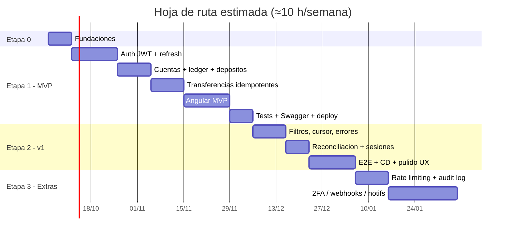
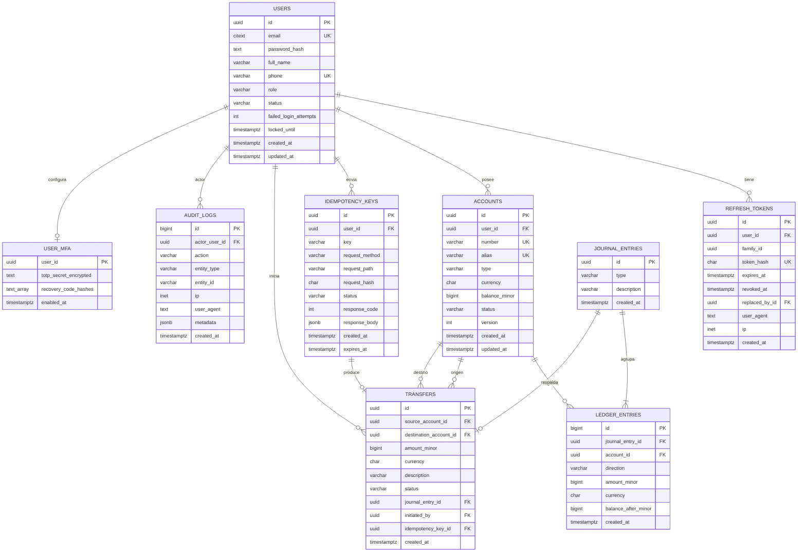
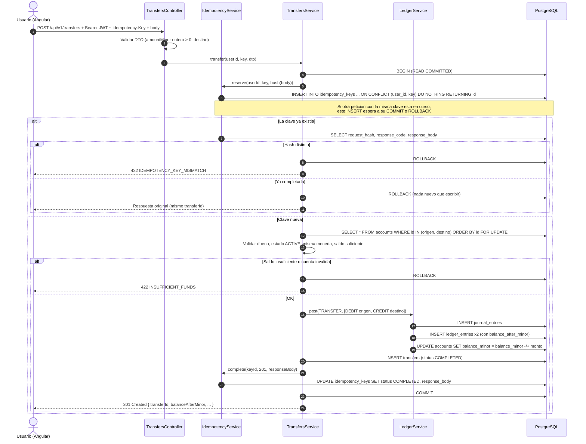
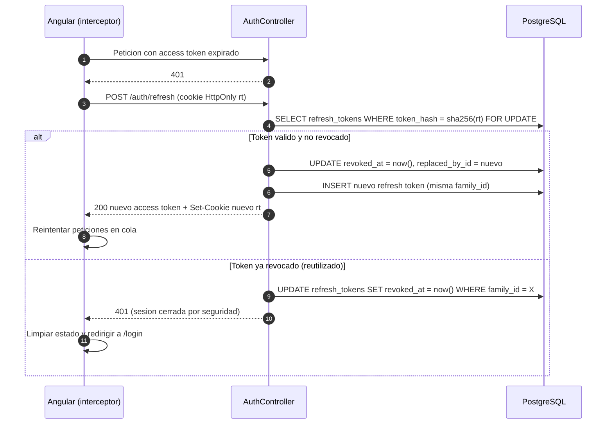

# Plan de proyecto — Billetera Digital

> Proyecto de portafolio de **Jhon Maquilon** (Full Stack Semi Senior: Angular 13+/20, TypeScript, NestJS, Rails, PostgreSQL), diseñado para demostrar en entrevistas con fintech (Nu, Lulo Bank, Bancolombia y similares) que sabe construir software donde **el dinero no se pierde, no se duplica y siempre cuadra**.

## 1. Objetivo

Construir una **billetera digital** full stack, desplegada y documentada, que muestre:

- **Autenticación robusta:** JWT de acceso de vida corta + *refresh tokens* rotativos con detección de reutilización.
- **Cuentas con saldo** en COP almacenado en **unidades mínimas enteras** (`BIGINT`), nunca en `float`.
- **Transferencias P2P** con **transacciones ACID**, **bloqueo de filas** (`SELECT … FOR UPDATE`) y **claves de idempotencia**.
- **Libro mayor de doble partida** (*double-entry ledger*) inmutable, con invariantes verificables (débitos = créditos).
- **Historial de movimientos** con filtros y paginación por cursor (*keyset*).
- **Documentación Swagger/OpenAPI**, **pruebas unitarias + e2e** (incluida una prueba de concurrencia), **Docker Compose**, **CI con GitHub Actions** y **despliegue en capas gratuitas**.

**Qué debe sentir un reclutador o un tech lead al abrir el repo:** "este dev entiende consistencia, concurrencia y seguridad; no es solo otro CRUD".

### 1.1 Nombre sugerido del repositorio

| Opción | Comentario |
|---|---|
| **`digital-wallet-ledger`** *(recomendado)* | En inglés (los equipos técnicos de fintech suelen trabajar en inglés), explica el producto y su característica estrella: el *ledger*. |
| `billetera-digital` | Más local; bueno si el público objetivo es solo Colombia. |
| `p2p-wallet-nest-angular` | Muy descriptivo del stack; bueno para SEO dentro de GitHub. |

Descripción corta del repo (GitHub "About"):
*"Digital wallet with double-entry ledger, idempotent P2P transfers and JWT refresh-token auth — NestJS · PostgreSQL · Angular (signals) · Docker · GitHub Actions."*

Topics: `nestjs`, `angular`, `postgresql`, `fintech`, `double-entry`, `ledger`, `idempotency`, `jwt`, `docker`, `typeorm`, `signals`.

### 1.2 Stack técnico

| Capa | Elección | Por qué |
|---|---|---|
| Monorepo | **pnpm workspaces** (Turborepo opcional) | Simple, rápido, un solo `pnpm-lock.yaml`; sin la curva de Nx. |
| Backend | **NestJS 11 + TypeScript (strict)** | Su stack principal; módulos, DI y guards encajan con el dominio. |
| ORM / migraciones | **TypeORM** con migraciones explícitas (`synchronize: false`) | Soporta `QueryRunner`, niveles de aislamiento y `setLock('pessimistic_write')` sin SQL crudo. *(Alternativa: Prisma, pero el bloqueo de filas requiere `$queryRaw`.)* |
| Base de datos | **PostgreSQL 16/17** | ACID, `CHECK`, índices parciales, `citext`, `jsonb`, triggers. |
| Auth | `@nestjs/jwt`, `passport-jwt`, **argon2id** | Estándar de la industria para hashing de contraseñas. |
| Validación | `class-validator` + `class-transformer`; config validada con **zod** | Falla rápido si falta una variable de entorno. |
| Docs API | `@nestjs/swagger` (OpenAPI 3) | `/api/docs` navegable + JSON para generar el cliente del front. |
| Frontend | **Angular 20+**: standalone, **signals**, `computed`, `effect`, nuevo control flow (`@if`, `@for`), interceptores y guards funcionales, *zoneless* | Muestra Angular moderno, no Angular "de 2018". |
| UI | Angular Material (M3) + SCSS | Productividad; accesibilidad incluida. |
| Tests API | Jest + Supertest + **Testcontainers** (Postgres real) | Las pruebas de concurrencia necesitan un Postgres de verdad, no mocks. |
| Tests web | Vitest o Jest (unitarias) + **Playwright** (e2e) | |
| Infra local | Docker Compose (postgres, api, web, mailpit opcional) | `docker compose up` y listo. |
| CI/CD | GitHub Actions | lint → typecheck → test → e2e → build → deploy. |
| Logs | `nestjs-pino` con *correlation id* | Logs estructurados en JSON. |

## 2. Supuestos de dedicación y estimaciones

- Jhon trabaja **lunes a viernes de 7:00 a.m. a 4:00/4:30 p.m. (hora Colombia)**.
- Capacidad realista: **4 noches × ~1,5 h + 1 bloque de 3–4 h el fin de semana ≈ 9–10 h/semana**.
- Las estimaciones incluyen escribir pruebas y documentación; añaden ~20 % de colchón para el cansancio y los imprevistos de las noches entre semana.
- Regla de oro: **cerrar cada noche con un commit verde** (aunque sea pequeño). Las tareas están cortadas en bloques de 1–2 h.

| Etapa | Esfuerzo estimado | Semanas (≈10 h/sem) | Resultado visible |
|---|---|---|---|
| 0. Fundaciones | 8–10 h | 1 | Monorepo, Docker Compose, CI en verde |
| 1. MVP | 70–80 h | 7–8 | **Demo desplegada**: registro, login, saldo, transferir, historial |
| 2. v1 | 45–50 h | 4–5 | Filtros + cursor, reconciliación, errores estándar, e2e completos, CD |
| 3. Extras (a elección) | 4–18 h c/u | 1–2 c/u | Rate limiting, audit log, 2FA, webhooks, notificaciones… |

**Total hasta v1:** ~125–140 h ≈ **3 meses** a ritmo nocturno. El MVP desplegado (semana 8–9) ya es presentable en entrevistas; v1 lo vuelve sobresaliente.



## 3. Funcionalidades por etapas, criterios de aceptación y esfuerzo

### Etapa 0 — Fundaciones (8–10 h · semana 1)

| # | Tarea | Esfuerzo |
|---|---|---|
| 0.1 | Monorepo con pnpm workspaces: `apps/api` (Nest CLI), `apps/web` (Angular CLI), `packages/` | 1,5 h |
| 0.2 | ESLint + Prettier + `tsconfig` estricto compartido; Husky + lint-staged + commitlint (Conventional Commits) | 1,5 h |
| 0.3 | `docker-compose.yml`: `postgres` (con *healthcheck* y volumen), `api`, `web`; `.env.example` | 2 h |
| 0.4 | Configuración validada con zod (`ConfigModule`), `TypeORM` + primera migración vacía, `GET /health` con `@nestjs/terminus` | 2 h |
| 0.5 | Workflow de CI esqueleto (lint + build de ambos apps) y protección de rama `main` | 1,5 h |

**Criterios de aceptación**

- [ ] `docker compose up --build` levanta Postgres, API y web sin pasos manuales.
- [ ] `GET /api/v1/health` responde `200` e incluye el estado de la BD.
- [ ] La API **no arranca** si falta una variable obligatoria (mensaje claro).
- [ ] Un PR a `main` ejecuta el CI y queda en verde; los commits siguen Conventional Commits.

### Etapa 1 — MVP (70–80 h · semanas 2–8)

#### 1.1 Autenticación con JWT + refresh tokens (14 h)

- Registro (`email`, `password`, `fullName`); el registro crea **usuario + billetera COP en la misma transacción**.
- Login → *access token* JWT (15 min, en memoria del front) + *refresh token* opaco (7 días) en **cookie `HttpOnly`, `Secure`, `SameSite`**, ruta restringida a `/api/v1/auth`.
- Refresh tokens **guardados como hash SHA-256**, con **rotación** en cada uso y `family_id`: si se reutiliza un token ya rotado → se revoca toda la familia (posible robo).
- Logout (revoca el token actual) y `GET /auth/me`.
- Bloqueo temporal tras 5 intentos fallidos.

**Criterios de aceptación**

- [ ] Contraseñas con argon2id; nunca se devuelven ni se registran en logs.
- [ ] Un refresh token solo sirve **una vez**; reutilizarlo devuelve `401` y revoca la familia (prueba e2e).
- [ ] El access token expirado devuelve `401`; el interceptor del front refresca **una sola vez** aunque haya varias peticiones concurrentes y reintenta.
- [ ] Mensajes de error de login genéricos ("credenciales inválidas"), sin revelar si el email existe.

#### 1.2 Cuentas y saldos (6 h)

- Cada usuario tiene una billetera (`USER_WALLET`) en COP con número legible (p. ej. `1000-0000-0042`) y una **llave/alias** opcional (inspirado en las llaves de pagos inmediatos: celular, correo o alias).
- Cuentas de sistema sembradas por migración: `SYSTEM_FUNDING` (origen de los depósitos simulados) y `SYSTEM_FEES` (futuras comisiones).
- `balance_minor` es un **saldo materializado** que se actualiza en la misma transacción que el ledger; la fuente de verdad es el ledger.

**Criterios de aceptación**

- [ ] `GET /accounts` solo devuelve cuentas del usuario autenticado (prueba de autorización: acceder a una cuenta ajena → `404`).
- [ ] La BD rechaza saldos negativos en billeteras de usuario (`CHECK`), aunque el código fallara.
- [ ] Los montos viajan como **enteros en unidades mínimas** (`amountMinor`) y el front los formatea con `Intl.NumberFormat('es-CO', { style: 'currency', currency: 'COP' })`.

#### 1.3 Ledger de doble partida (8 h)

- `LedgerService.post(journal)` es **el único punto** que escribe `journal_entries` + `ledger_entries` y actualiza saldos.
- Cada asiento tiene ≥ 2 líneas; **Σ débitos = Σ créditos** por asiento y por moneda; cada línea guarda `balance_after_minor`.
- Las tablas del ledger son **append-only**: un trigger impide `UPDATE`/`DELETE`. Las correcciones se hacen con asientos compensatorios (reversos), nunca editando.

**Criterios de aceptación**

- [ ] Intentar postear un asiento descuadrado lanza error y no escribe nada (unitaria).
- [ ] `UPDATE ledger_entries …` falla a nivel de BD (e2e).
- [ ] Para toda cuenta: `balance_minor = Σ créditos − Σ débitos` (consulta de verificación usada en tests).

#### 1.4 Depósito simulado / *sandbox top-up* (3 h)

- `POST /deposits` (solo entorno demo, con límite por día) mueve dinero de `SYSTEM_FUNDING` a la billetera del usuario mediante un asiento contable. Permite probar la app sin pasarela de pagos real.

**Criterios de aceptación**

- [ ] El depósito genera un asiento de 2 líneas y aparece en el historial como `DEPOSIT`.
- [ ] Respeta el límite diario configurable (`DEMO_DEPOSIT_DAILY_LIMIT_MINOR`).

#### 1.5 Transferencias P2P con ACID + idempotencia (12 h) — *la pieza estrella*

- `POST /transfers` con header obligatorio **`Idempotency-Key`** (UUID v4 generado por el cliente).
- En **una sola transacción** (`READ COMMITTED`): registrar la clave de idempotencia → **bloquear ambas cuentas con `FOR UPDATE` en orden determinista (por `id`)** para evitar *deadlocks* → validar estado, moneda y saldo → postear asiento → actualizar saldos → crear `transfers` → guardar la respuesta en `idempotency_keys` → `COMMIT`.
- Destinatario por número de cuenta o llave/alias; no se permite transferirse a sí mismo.
- Ver flujo detallado en la sección 5.

**Criterios de aceptación**

- [ ] Repetir la misma petición con la misma clave devuelve **la misma respuesta y el mismo `transferId`**, con un solo débito (e2e).
- [ ] Misma clave con un cuerpo distinto → `422 IDEMPOTENCY_KEY_MISMATCH`.
- [ ] Sin `Idempotency-Key` → `400`.
- [ ] **Prueba de concurrencia:** 50 transferencias simultáneas de 10.000 COP desde una cuenta con 100.000 COP → exactamente 10 exitosas, 40 con `422 INSUFFICIENT_FUNDS`, saldo final 0, ledger cuadrado, sin *deadlocks*.
- [ ] Monto ≤ 0, monto no entero o por encima del máximo → `400`.
- [ ] Si algo falla a mitad de camino, no queda **nada** escrito (rollback total).

#### 1.6 Historial de movimientos básico (5 h)

- `GET /accounts/:id/transactions?limit=20&cursor=…` basado en `ledger_entries` (un movimiento por línea de la cuenta), con contraparte, tipo (`TRANSFER_IN`, `TRANSFER_OUT`, `DEPOSIT`), monto, saldo posterior y fecha.
- Paginación por cursor (`created_at`, `id`) desde el inicio (el *offset* se degrada con tablas grandes).

**Criterios de aceptación**

- [ ] Orden estable descendente; no hay duplicados ni saltos entre páginas aunque entren movimientos nuevos.
- [ ] Respuesta `{ data: [...], pageInfo: { nextCursor, hasNextPage } }`.

#### 1.7 Swagger / OpenAPI (2 h)

- `/api/docs` con esquemas de DTOs, ejemplos, códigos de error, `bearerAuth` y el header `Idempotency-Key` documentado.

**Criterios de aceptación**

- [ ] Todos los endpoints tienen `@ApiOperation`, respuestas de éxito y error documentadas.
- [ ] Se puede hacer login y transferir desde Swagger UI.

#### 1.8 Pruebas del MVP (10 h)

- Unitarias: `LedgerService`, `TransfersService` (con repositorios simulados), `AuthService` (rotación/reuso), `MoneyPipe` del front.
- E2E con Testcontainers: registro → login → depósito → transferencia → historial; idempotencia; concurrencia; reutilización de refresh token.

**Criterios de aceptación**

- [ ] `pnpm test` y `pnpm test:e2e` pasan en local y en CI.
- [ ] Cobertura ≥ 80 % en los módulos `ledger`, `transfers` y `auth`.

#### 1.9 Frontend Angular del MVP (16 h)

- Pantallas: login, registro, dashboard (saldo + últimos movimientos), enviar dinero (asistente de 3 pasos), historial.
- `AuthStore` con signals (`currentUser`, `isAuthenticated = computed(...)`), interceptor funcional que agrega el Bearer y gestiona el refresh, guards funcionales (`authGuard`, `guestGuard`), rutas *lazy* con `loadComponent`.
- El paso "Confirmar" del asistente **genera la `Idempotency-Key` una sola vez** y la reutiliza si el usuario reintenta o hay un error de red (evita el doble cobro por doble clic).

**Criterios de aceptación**

- [ ] Flujo completo usable en móvil (responsive) y con teclado.
- [ ] Doble clic en "Enviar" no genera dos transferencias (botón deshabilitado + misma clave).
- [ ] Errores de negocio mostrados de forma amigable (saldo insuficiente, destinatario no encontrado).

#### 1.10 Despliegue básico (3 h)

- API + BD + front desplegados en capas gratuitas (ver sección 11), con usuario demo documentado en el README.

**Criterios de aceptación**

- [ ] URL pública funcionando; el README tiene enlaces a la demo y a Swagger.
- [ ] Migraciones ejecutadas en el arranque del despliegue (o paso previo), nunca `synchronize`.

### Etapa 2 — v1 (45–50 h · semanas 9–13)

| # | Funcionalidad | Esfuerzo | Criterios de aceptación |
|---|---|---|---|
| 2.1 | **Filtros avanzados** en historial: tipo, dirección (entrada/salida), rango de fechas, rango de montos, texto (descripción/contraparte) + cursor | 6 h | Filtros combinables, validados con DTO; índices usados (verificar con `EXPLAIN ANALYZE` y documentarlo en `docs/`). |
| 2.2 | **Detalle / comprobante** de transacción (`GET /transfers/:id`) y vista imprimible en el front | 3 h | Solo emisor o receptor pueden verlo (`404` para terceros). |
| 2.3 | **Errores estándar** (RFC 9457 *Problem Details*), códigos de negocio estables (`INSUFFICIENT_FUNDS`, `ACCOUNT_FROZEN`…), *correlation id* (`X-Request-Id`) y logs JSON con `nestjs-pino` | 5 h | Todas las respuestas de error comparten formato; ningún *stack trace* llega al cliente en producción. |
| 2.4 | **Reconciliación**: `GET /admin/reconciliation` + tarea programada (`@nestjs/schedule`) que verifica `balance_minor` vs. ledger y Σ débitos = Σ créditos global | 5 h | Ante un descuadre inyectado en un test, el reporte lo detecta y lo registra como error. |
| 2.5 | **Sesiones activas**: listar sesiones (refresh tokens vigentes con *user agent*/IP), cerrar una o todas | 4 h | "Cerrar todas" invalida todos los refresh tokens del usuario. |
| 2.6 | **Límites de negocio**: monto máximo por transferencia y tope diario por usuario | 3 h | Superar el tope → `422 DAILY_LIMIT_EXCEEDED`; límites configurables por env. |
| 2.7 | **E2E ampliados** (API) + **Playwright** (web): login, transferir, filtrar historial | 8 h | Corren en CI; Playwright guarda *traces* como artefacto si falla. |
| 2.8 | **CI/CD completo**: cobertura publicada, build de imagen Docker, despliegue automático al hacer merge a `main` | 5 h | Badge de CI y de cobertura en el README; despliegue solo si todo pasa. |
| 2.9 | **Pulido UX**: *skeletons*, estados vacíos, manejo de errores global, accesibilidad (WCAG AA básico), modo oscuro opcional | 6 h | Lighthouse ≥ 90 en accesibilidad y buenas prácticas. |
| 2.10 | **Datos demo**: script de *seed* con usuarios y movimientos realistas | 2 h | `pnpm seed` deja la app lista para mostrar en 1 comando. |
| 2.11 | **Cliente tipado** del front generado desde OpenAPI (`openapi-typescript`) | 2 h | Si cambia un DTO en la API, el build del front falla hasta regenerar tipos. |

### Etapa 3 — Extras (elegir según el tiempo; cada uno es independiente)

| Extra | Esfuerzo | Descripción | Criterios de aceptación |
|---|---|---|---|
| **Rate limiting** | 4–6 h | `@nestjs/throttler`: límites estrictos en `/auth/login`, `/auth/refresh` y `POST /transfers`, por IP y por usuario; headers `RateLimit-*` / `Retry-After` | Exceder el límite → `429` con `Retry-After`; e2e lo verifica. |
| **Audit log** | 6–8 h | Tabla *append-only* con actor, acción, entidad, IP, *user agent* y metadatos (`jsonb`); se escribe en login, logout, cambio de contraseña, transferencias, 2FA. Vista admin con filtros | Cada acción sensible deja exactamente un registro; los registros no se pueden editar. |
| **2FA (TOTP)** | 10–12 h | `otplib`: activar con QR, códigos de recuperación (hash), login en dos pasos y *step-up* para transferencias > umbral | Sin código válido no se emite el access token; secreto TOTP cifrado en reposo. |
| **Webhooks** | 14–18 h | Patrón **Transactional Outbox**: el evento `transfer.completed` se inserta en `outbox_events` dentro de la misma transacción; un *worker* lo entrega firmado con **HMAC-SHA256**, con reintentos y *backoff* exponencial | El evento no se pierde si la API cae tras el commit; el receptor puede verificar la firma; reintentos visibles en `webhook_deliveries`. |
| **Notificaciones** | 8–10 h | In-app en tiempo real con **SSE** ("Recibiste $50.000 de Ana") + email en local con Mailpit; alimentadas por el outbox | El receptor ve la notificación sin recargar; contador de no leídas con signals. |
| **Reversos** | 5–6 h | Endpoint admin que crea un asiento compensatorio y marca la transferencia `REVERSED` | El asiento original no se modifica; saldos y ledger siguen cuadrando. |
| **Observabilidad** | 5–6 h | OpenTelemetry (trazas HTTP + SQL), métricas Prometheus (`/metrics`) | Una transferencia se puede seguir de punta a punta por su `traceId`. |
| **Solicitar dinero / QR** | 6–8 h | Solicitudes de pago y QR con la llave del usuario | Aceptar una solicitud ejecuta una transferencia idempotente. |

## 4. Modelo de datos

Convenciones: PostgreSQL, `uuid` con `gen_random_uuid()`, `timestamptz` en UTC, nombres en `snake_case`, montos en **`BIGINT` de unidades mínimas** (`amount_minor`), moneda ISO 4217 (`char(3)`). Extensiones: `pgcrypto`, `citext`.

**Convención contable:** para todas las cuentas, `saldo = Σ CREDIT − Σ DEBIT`. Una transferencia **debita** al emisor y **acredita** al receptor. La cuenta `SYSTEM_FUNDING` queda en negativo al hacer depósitos: representa el dinero que "entró" al sistema, de modo que la suma de todos los saldos siempre es 0.



### 4.1 Tablas del núcleo (MVP / v1)

**`users`**

| Columna | Tipo | Restricciones |
|---|---|---|
| `id` | `uuid` | PK, `DEFAULT gen_random_uuid()` |
| `email` | `citext` | `NOT NULL`, `UNIQUE` |
| `password_hash` | `text` | `NOT NULL` (argon2id) |
| `full_name` | `varchar(120)` | `NOT NULL` |
| `phone` | `varchar(20)` | `UNIQUE`, nullable |
| `role` | `varchar(20)` | `NOT NULL DEFAULT 'USER'`, `CHECK (role IN ('USER','ADMIN'))` |
| `status` | `varchar(20)` | `NOT NULL DEFAULT 'ACTIVE'`, `CHECK (status IN ('ACTIVE','LOCKED','DISABLED'))` |
| `failed_login_attempts` | `int` | `NOT NULL DEFAULT 0` |
| `locked_until` | `timestamptz` | nullable |
| `created_at` / `updated_at` | `timestamptz` | `NOT NULL DEFAULT now()` |

**`refresh_tokens`**

| Columna | Tipo | Restricciones |
|---|---|---|
| `id` | `uuid` | PK |
| `user_id` | `uuid` | `NOT NULL`, FK → `users(id) ON DELETE CASCADE` |
| `family_id` | `uuid` | `NOT NULL` (todas las rotaciones de un mismo login) |
| `token_hash` | `char(64)` | `NOT NULL`, `UNIQUE` (SHA-256 del token opaco) |
| `expires_at` | `timestamptz` | `NOT NULL` |
| `revoked_at` | `timestamptz` | nullable |
| `replaced_by_id` | `uuid` | FK → `refresh_tokens(id)`, nullable |
| `user_agent` / `ip` | `text` / `inet` | nullable |
| `created_at` | `timestamptz` | `NOT NULL DEFAULT now()` |

Índices: `(user_id) WHERE revoked_at IS NULL`, `(family_id)`.

**`accounts`**

| Columna | Tipo | Restricciones |
|---|---|---|
| `id` | `uuid` | PK |
| `user_id` | `uuid` | FK → `users(id)`, nullable (las cuentas de sistema no tienen usuario) |
| `number` | `varchar(20)` | `NOT NULL`, `UNIQUE` |
| `alias` | `varchar(50)` | `UNIQUE`, nullable (llave) |
| `type` | `varchar(20)` | `NOT NULL`, `CHECK (type IN ('USER_WALLET','SYSTEM_FUNDING','SYSTEM_FEES'))` |
| `currency` | `char(3)` | `NOT NULL DEFAULT 'COP'` |
| `balance_minor` | `bigint` | `NOT NULL DEFAULT 0` |
| `status` | `varchar(20)` | `NOT NULL DEFAULT 'ACTIVE'`, `CHECK (status IN ('ACTIVE','FROZEN','CLOSED'))` |
| `version` | `int` | `NOT NULL DEFAULT 0` (auditoría de cambios / bloqueo optimista futuro) |
| `created_at` / `updated_at` | `timestamptz` | `NOT NULL DEFAULT now()` |

Restricciones adicionales:

```sql
CONSTRAINT chk_wallet_non_negative CHECK (type <> 'USER_WALLET' OR balance_minor >= 0),
CONSTRAINT chk_wallet_has_owner   CHECK ((type = 'USER_WALLET') = (user_id IS NOT NULL))
-- una billetera por usuario y moneda
CREATE UNIQUE INDEX ux_accounts_user_currency ON accounts(user_id, currency) WHERE type = 'USER_WALLET';
CREATE INDEX ix_accounts_user ON accounts(user_id);
```

**`journal_entries`** (cabecera del asiento — inmutable)

| Columna | Tipo | Restricciones |
|---|---|---|
| `id` | `uuid` | PK |
| `type` | `varchar(20)` | `NOT NULL`, `CHECK (type IN ('TRANSFER','DEPOSIT','FEE','REVERSAL'))` |
| `description` | `varchar(140)` | nullable |
| `created_at` | `timestamptz` | `NOT NULL DEFAULT now()` |

**`ledger_entries`** (líneas del asiento — inmutable)

| Columna | Tipo | Restricciones |
|---|---|---|
| `id` | `bigint` | PK, `GENERATED ALWAYS AS IDENTITY` |
| `journal_entry_id` | `uuid` | `NOT NULL`, FK → `journal_entries(id)` |
| `account_id` | `uuid` | `NOT NULL`, FK → `accounts(id)` |
| `direction` | `varchar(6)` | `NOT NULL`, `CHECK (direction IN ('DEBIT','CREDIT'))` |
| `amount_minor` | `bigint` | `NOT NULL`, `CHECK (amount_minor > 0)` |
| `currency` | `char(3)` | `NOT NULL` |
| `balance_after_minor` | `bigint` | `NOT NULL` |
| `created_at` | `timestamptz` | `NOT NULL DEFAULT now()` |

Índices: `(account_id, created_at DESC, id DESC)` (historial con cursor), `(journal_entry_id)`.
Triggers: `BEFORE UPDATE OR DELETE` → `RAISE EXCEPTION 'ledger is append-only'` (en `journal_entries` y `ledger_entries`). En v1, *constraint trigger* `DEFERRABLE INITIALLY DEFERRED` que verifica al `COMMIT` que cada asiento cuadra.

**`transfers`**

| Columna | Tipo | Restricciones |
|---|---|---|
| `id` | `uuid` | PK |
| `source_account_id` | `uuid` | `NOT NULL`, FK → `accounts(id)` |
| `destination_account_id` | `uuid` | `NOT NULL`, FK → `accounts(id)`, `CHECK (source_account_id <> destination_account_id)` |
| `amount_minor` | `bigint` | `NOT NULL`, `CHECK (amount_minor > 0)` |
| `currency` | `char(3)` | `NOT NULL` |
| `description` | `varchar(140)` | nullable |
| `status` | `varchar(20)` | `NOT NULL`, `CHECK (status IN ('COMPLETED','REVERSED'))` (`PENDING` reservado para 2FA *step-up*) |
| `journal_entry_id` | `uuid` | `UNIQUE`, FK → `journal_entries(id)` |
| `initiated_by` | `uuid` | `NOT NULL`, FK → `users(id)` |
| `idempotency_key_id` | `uuid` | `UNIQUE`, FK → `idempotency_keys(id)` |
| `created_at` | `timestamptz` | `NOT NULL DEFAULT now()` |

Índices: `(source_account_id, created_at DESC)`, `(destination_account_id, created_at DESC)`.

**`idempotency_keys`**

| Columna | Tipo | Restricciones |
|---|---|---|
| `id` | `uuid` | PK |
| `user_id` | `uuid` | `NOT NULL`, FK → `users(id)` |
| `key` | `varchar(255)` | `NOT NULL` |
| `request_method` / `request_path` | `varchar(10)` / `varchar(255)` | `NOT NULL` |
| `request_hash` | `char(64)` | `NOT NULL` (SHA-256 del cuerpo normalizado) |
| `status` | `varchar(20)` | `NOT NULL`, `CHECK (status IN ('IN_PROGRESS','COMPLETED'))` |
| `response_code` | `int` | nullable |
| `response_body` | `jsonb` | nullable |
| `created_at` | `timestamptz` | `NOT NULL DEFAULT now()` |
| `expires_at` | `timestamptz` | `NOT NULL` (p. ej. `created_at + 24 h`) |

Índices: `UNIQUE (user_id, key)`, `(expires_at)` para el *job* de limpieza.

### 4.2 Tablas de extras (Etapa 3)

| Tabla | Columnas clave | Restricciones / índices |
|---|---|---|
| `audit_logs` | `id bigint identity`, `actor_user_id uuid`, `action varchar(60)`, `entity_type varchar(40)`, `entity_id varchar(64)`, `ip inet`, `user_agent text`, `metadata jsonb`, `created_at` | *Append-only* (trigger); índices `(actor_user_id, created_at DESC)`, `(entity_type, entity_id)` |
| `user_mfa` | `user_id uuid PK/FK`, `totp_secret_encrypted text`, `recovery_code_hashes text[]`, `enabled_at timestamptz` | Secreto cifrado con AES-256-GCM (clave en env) |
| `outbox_events` | `id bigint identity`, `aggregate_type`, `aggregate_id uuid`, `event_type varchar(60)`, `payload jsonb`, `created_at`, `processed_at` | Índice parcial `(created_at) WHERE processed_at IS NULL`; el *worker* usa `FOR UPDATE SKIP LOCKED` |
| `webhook_endpoints` | `id uuid`, `user_id uuid FK`, `url text`, `secret_encrypted text`, `events text[]`, `is_active bool`, `created_at` | `CHECK (url LIKE 'https://%')` en producción |
| `webhook_deliveries` | `id uuid`, `endpoint_id FK`, `event_id FK`, `status`, `attempt_count int`, `next_attempt_at`, `last_response_code int`, `last_error text`, `created_at` | Índice `(status, next_attempt_at)`; `UNIQUE (endpoint_id, event_id)` |
| `notifications` | `id uuid`, `user_id FK`, `type`, `title`, `body`, `read_at`, `created_at` | Índice `(user_id, created_at DESC)`, parcial `WHERE read_at IS NULL` |

## 5. Flujos clave

### 5.1 Transferencia P2P con idempotencia y bloqueo de filas

Decisiones:

1. **Todo ocurre en una única transacción.** La fila de idempotencia, el asiento, los saldos y la transferencia se confirman juntos o no se confirma nada.
2. **El índice único `(user_id, key)` actúa como "candado" natural:** si llega un duplicado mientras la primera petición sigue en curso, su `INSERT … ON CONFLICT DO NOTHING` **espera** a que la primera haga `COMMIT`/`ROLLBACK`. Luego lee la respuesta guardada (o, si la primera falló, procesa normalmente).
3. **Bloqueo pesimista ordenado:** `SELECT … FOR UPDATE` sobre ambas cuentas **ordenadas por `id`**. Dos transferencias cruzadas (A→B y B→A) piden los candados en el mismo orden ⇒ no hay *deadlock*.
4. **`READ COMMITTED` + `FOR UPDATE`** es suficiente y más barato que `SERIALIZABLE` (que obligaría a reintentar ante errores de serialización). El `CHECK (balance_minor >= 0)` es la última red de seguridad.
5. Los rechazos de negocio (p. ej. saldo insuficiente) hacen *rollback* y **no** guardan la clave: un reintento se vuelve a evaluar (por ejemplo, tras un depósito). Se documenta como decisión consciente (Stripe, por ejemplo, sí guarda también los errores).



Esqueleto del servicio (TypeORM):

```ts
async transfer(userId: string, key: string, dto: CreateTransferDto) {
  return this.dataSource.transaction('READ COMMITTED', async (em) => {
    const reservation = await this.idempotency.reserve(em, userId, key, dto);
    if (reservation.replay) return reservation.storedResponse; // misma respuesta

    const ids = [dto.sourceAccountId, destinationId].sort();
    const accounts = await em.getRepository(Account)
      .createQueryBuilder('a')
      .setLock('pessimistic_write')            // SELECT ... FOR UPDATE
      .where('a.id IN (:...ids)', { ids })
      .orderBy('a.id', 'ASC')                  // orden determinista => sin deadlocks
      .getMany();

    this.rules.assertCanTransfer(userId, accounts, dto); // dueño, estado, moneda, saldo
    const journal = await this.ledger.post(em, {
      type: 'TRANSFER',
      lines: [
        { accountId: source.id, direction: 'DEBIT',  amountMinor: dto.amountMinor },
        { accountId: dest.id,   direction: 'CREDIT', amountMinor: dto.amountMinor },
      ],
    });
    const transfer = await em.save(Transfer, { /* ... */ journalEntryId: journal.id });
    const response = TransferResponseDto.from(transfer, source);
    await this.idempotency.complete(em, reservation.id, 201, response);
    return response;
  });
}
```

### 5.2 Asientos del ledger (ejemplos)

| Operación | Línea 1 | Línea 2 | Efecto |
|---|---|---|---|
| Depósito demo de $100.000 | `DEBIT SYSTEM_FUNDING 10.000.000` | `CREDIT wallet_ana 10.000.000` | Ana +100.000; FUNDING −100.000 |
| Transferencia Ana → Luis $25.000 | `DEBIT wallet_ana 2.500.000` | `CREDIT wallet_luis 2.500.000` | Ana −25.000; Luis +25.000 |
| (Extra) Comisión $500 | `DEBIT wallet_ana 50.000` | `CREDIT SYSTEM_FEES 50.000` | Mismo asiento que la transferencia (3–4 líneas) |
| (Extra) Reverso de la transferencia | `DEBIT wallet_luis 2.500.000` | `CREDIT wallet_ana 2.500.000` | Nuevo asiento `REVERSAL`; el original no se toca |

*(COP tiene 2 decimales según ISO 4217: $25.000,00 = `2.500.000` unidades mínimas.)*

Invariantes verificadas por tests y por la reconciliación:

```sql
-- 1) Cada asiento cuadra
SELECT journal_entry_id FROM ledger_entries
GROUP BY journal_entry_id
HAVING SUM(CASE direction WHEN 'DEBIT' THEN amount_minor ELSE 0 END)
    <> SUM(CASE direction WHEN 'CREDIT' THEN amount_minor ELSE 0 END);   -- debe devolver 0 filas

-- 2) El saldo materializado coincide con el ledger
SELECT a.id FROM accounts a
LEFT JOIN ledger_entries le ON le.account_id = a.id
GROUP BY a.id, a.balance_minor
HAVING a.balance_minor <> COALESCE(SUM(CASE le.direction WHEN 'CREDIT' THEN le.amount_minor
                                                         ELSE -le.amount_minor END), 0); -- 0 filas
```

### 5.3 Rotación de refresh tokens con detección de reutilización



## 6. Endpoints de la API

Prefijo `/api/v1`. Autenticación: `Bearer` salvo donde se indica. Documentación en `/api/docs` (UI) y `/api/docs-json` (OpenAPI).

| Método | Ruta | Auth | Etapa | Descripción |
|---|---|---|---|---|
| GET | `/health` | — | 0 | Estado de la API y de la BD |
| POST | `/auth/register` | — | MVP | Crea usuario + billetera; devuelve access token + cookie |
| POST | `/auth/login` | — | MVP | Login; `200` o `202 { mfaRequired }` si hay 2FA |
| POST | `/auth/refresh` | Cookie | MVP | Rota el refresh token |
| POST | `/auth/logout` | Cookie | MVP | Revoca el refresh token actual |
| GET | `/auth/me` | ✔ | MVP | Perfil del usuario autenticado |
| GET | `/auth/sessions` | ✔ | v1 | Sesiones activas |
| DELETE | `/auth/sessions/:id` | ✔ | v1 | Cerrar una sesión |
| DELETE | `/auth/sessions` | ✔ | v1 | Cerrar todas las sesiones |
| GET | `/accounts` | ✔ | MVP | Cuentas del usuario con saldo |
| GET | `/accounts/:id` | ✔ | MVP | Detalle de cuenta |
| PATCH | `/accounts/:id/alias` | ✔ | v1 | Definir llave/alias |
| GET | `/accounts/lookup?alias=…\|number=…` | ✔ | MVP | Resolver destinatario (devuelve nombre enmascarado: "Ana M***") |
| GET | `/accounts/:id/transactions` | ✔ | MVP/v1 | Historial: `limit`, `cursor`, `type`, `direction`, `from`, `to`, `minAmount`, `maxAmount`, `q` |
| POST | `/deposits` | ✔ | MVP | Depósito simulado (solo demo) — requiere `Idempotency-Key` |
| POST | `/transfers` | ✔ | MVP | Transferencia P2P — requiere `Idempotency-Key` |
| GET | `/transfers/:id` | ✔ | v1 | Detalle / comprobante |
| GET | `/admin/reconciliation` | Admin | v1 | Reporte de cuadre del ledger |
| POST | `/admin/transfers/:id/reverse` | Admin | Extra | Reverso con asiento compensatorio |
| GET | `/admin/audit-logs` | Admin | Extra | Audit log con filtros y cursor |
| POST | `/auth/2fa/setup` | ✔ | Extra | Genera secreto + QR |
| POST | `/auth/2fa/enable` | ✔ | Extra | Confirma con código TOTP |
| POST | `/auth/2fa/verify` | Token MFA temporal | Extra | Segundo paso del login |
| POST | `/auth/2fa/disable` | ✔ + TOTP | Extra | Desactiva 2FA |
| GET/POST | `/webhooks/endpoints` | ✔ | Extra | Listar / registrar endpoints |
| DELETE | `/webhooks/endpoints/:id` | ✔ | Extra | Eliminar endpoint |
| GET | `/webhooks/deliveries` | ✔ | Extra | Intentos de entrega |
| GET | `/notifications` | ✔ | Extra | Lista con cursor |
| PATCH | `/notifications/:id/read` | ✔ | Extra | Marcar como leída |
| GET | `/notifications/stream` | ✔ | Extra | SSE en tiempo real |

Ejemplo de petición/respuesta:

```http
POST /api/v1/transfers
Authorization: Bearer eyJhbGciOi...
Idempotency-Key: 9b2f7c1e-3a54-4d1e-9a51-6f0c2b8d7e10
Content-Type: application/json

{ "sourceAccountId": "6c1e…", "destination": { "alias": "@luis" },
  "amountMinor": 2500000, "description": "Almuerzo" }
```

```json
{ "id": "f3a9…", "status": "COMPLETED", "amountMinor": 2500000, "currency": "COP",
  "destination": { "name": "Luis P***", "accountNumber": "****0042" },
  "balanceAfterMinor": 7500000, "createdAt": "2026-10-20T01:15:42.000Z" }
```

Errores (RFC 9457):

```json
{ "type": "https://errors.wallet.dev/insufficient-funds", "title": "Insufficient funds",
  "status": 422, "code": "INSUFFICIENT_FUNDS", "detail": "Available balance is lower than the amount.",
  "instance": "/api/v1/transfers", "requestId": "01J…" }
```

## 7. Pantallas de Angular

| Pantalla | Ruta | Etapa | Contenido / detalles técnicos |
|---|---|---|---|
| Login | `/login` | MVP | Reactive forms tipados, `guestGuard`, manejo de errores genérico |
| Registro | `/register` | MVP | Validación de fuerza de contraseña, confirmación |
| Dashboard | `/` | MVP | Tarjeta de saldo (`computed` formateado), acciones rápidas, últimos 5 movimientos |
| Enviar dinero | `/transfer` | MVP | Asistente: 1) destinatario (lookup por llave/número) → 2) monto y descripción → 3) confirmar; `Idempotency-Key` creada al entrar al paso 3 |
| Resultado / comprobante | `/transfer/:id` | MVP/v1 | Estado, datos enmascarados, botón imprimir/compartir |
| Historial | `/transactions` | MVP/v1 | Filtros sincronizados con *query params*, scroll infinito con cursor, estados vacíos |
| Recargar (demo) | `/deposit` | MVP | Montos rápidos, aviso "dinero ficticio" |
| Perfil y seguridad | `/settings/security` | v1/Extra | Cambiar contraseña, sesiones activas, activar 2FA (QR) |
| Notificaciones | panel en *toolbar* | Extra | Contador no leídas (signal) alimentado por SSE |
| Webhooks (desarrollador) | `/settings/developers` | Extra | Registrar URL, ver secreto una vez, historial de entregas |
| Admin: reconciliación / audit | `/admin/*` | v1/Extra | `adminGuard`, tablas con filtros |
| 404 / error | `**` | MVP | Página amable con regreso al inicio |

Prácticas Angular a mostrar: componentes standalone con `ChangeDetectionStrategy.OnPush`, `input()`/`output()` basados en signals, `inject()`, stores de *feature* con `signal`/`computed` (o NgRx SignalStore), `toSignal` para *query params*, `@defer` para widgets no críticos, interceptores funcionales (`authInterceptor`, `errorInterceptor`, `requestIdInterceptor`), `MoneyPipe` (unidades mínimas → `Intl.NumberFormat`), rutas *lazy*, *zoneless*.

## 8. Estrategia de pruebas

| Nivel | Herramientas | Qué cubre | Meta |
|---|---|---|---|
| Unitarias API | Jest | `LedgerService` (cuadre, saldos), reglas de transferencia, rotación de refresh tokens, hashing de idempotencia, mapeo de errores | ≥ 80 % en `ledger`, `transfers`, `auth`, `idempotency` |
| Integración / e2e API | Jest + Supertest + **Testcontainers** (Postgres real; en CI también sirve un *service container*) | Flujos HTTP completos, migraciones reales, triggers, `CHECK` | Todos los criterios de aceptación de la API |
| Concurrencia | e2e con `Promise.all` de N peticiones | Sin saldo negativo, sin *deadlocks*, ledger cuadrado, idempotencia bajo carrera (misma clave en paralelo → 1 sola transferencia) | Obligatoria en CI |
| Propiedades (opcional) | `fast-check` | Secuencias aleatorias de depósitos/transferencias ⇒ Σ saldos = 0 siempre | Extra que impresiona |
| Unitarias web | Vitest/Jest + Angular Testing Library | Stores con signals, interceptor de refresh (cola de peticiones), `MoneyPipe`, guards | ≥ 70 % en `core/` y `features/*/data-access` |
| E2E web | Playwright | Login → transferir → ver en historial; doble clic no duplica | *Happy path* + 2 casos de error |
| Contrato | OpenAPI generado + tipos del front | El front compila contra el contrato real | En CI |
| Carga (opcional) | k6 | p95 de `POST /transfers` y comportamiento bajo contención | Documentar resultados en `docs/` |

Reglas: cada test de BD corre dentro de un esquema limpio (truncate entre suites); nada de `synchronize`; los e2e usan las mismas migraciones que producción.

## 9. Checklist de seguridad

**Dinero y consistencia**

- [ ] Montos en **enteros de unidades mínimas** (`BIGINT` en BD, `bigint`/entero validado en TS); prohibido `float`/`number` con decimales para dinero. Alternativa válida: `NUMERIC(19,4)` (nunca `real`/`double`).
- [ ] Validación de monto: entero, `> 0`, `≤ MAX_TRANSFER_MINOR`, dentro de `Number.MAX_SAFE_INTEGER`.
- [ ] Transacciones ACID, `FOR UPDATE` ordenado, `CHECK` de saldo no negativo, ledger *append-only* con triggers.
- [ ] Idempotencia obligatoria en operaciones que mueven dinero; claves con expiración.
- [ ] Reconciliación periódica y alertas ante descuadres.

**OWASP Top 10 / API Security (básicos)**

- [ ] **Broken Access Control / BOLA:** cada consulta filtra por `user_id` del token; probar acceso a recursos ajenos (`404`). Nunca confiar en un `userId` enviado por el cliente.
- [ ] **Autenticación:** argon2id, access token corto (15 min), refresh rotativo con hash y detección de reutilización, bloqueo por intentos, mensajes genéricos.
- [ ] **JWT:** algoritmo fijo (`HS256` con secreto ≥ 256 bits o `RS256`), validar `exp`, `iss`, `aud`; no guardar datos sensibles en el payload.
- [ ] **Cookies:** `HttpOnly`, `Secure`, `SameSite=Strict/Lax`, `Path=/api/v1/auth`; mitigación CSRF en `/auth/refresh` (verificar `Origin` + `SameSite`; *double-submit token* si el despliegue es *cross-site*).
- [ ] **Inyección:** solo consultas parametrizadas / QueryBuilder; nunca concatenar SQL.
- [ ] **Validación de entrada:** `ValidationPipe({ whitelist: true, forbidNonWhitelisted: true, transform: true })`.
- [ ] **Exposición de datos:** DTOs de respuesta explícitos (sin `password_hash`), nombres y cuentas enmascarados en lookups, sin *stack traces* en producción.
- [ ] **Rate limiting** en login, refresh y transferencias (Etapa 3; mínimo en login desde el MVP si sobra tiempo).
- [ ] **Cabeceras:** `helmet`, CORS con lista blanca exacta (sin `*` con credenciales), HTTPS obligatorio.
- [ ] **Secretos:** solo por variables de entorno / secrets de GitHub; `.env` en `.gitignore`; *secret scanning* y *push protection* activados.
- [ ] **Dependencias:** Dependabot + `pnpm audit` en CI; CodeQL opcional.
- [ ] **Logs:** sin contraseñas, tokens ni datos personales completos (redacción con pino `redact`).
- [ ] **Usuario de BD** con privilegios mínimos para la app (sin `SUPERUSER`); migraciones con otro rol si es posible.
- [ ] **Frontend:** access token solo en memoria (no `localStorage`); confiar en el *sanitizer* de Angular, evitar `bypassSecurityTrust*`; CSP básica.
- [ ] **Webhooks (extra):** firma HMAC con *timestamp* (anti-*replay*), solo HTTPS, *timeouts* y protección SSRF (bloquear IPs privadas).
- [ ] **2FA (extra):** secreto TOTP cifrado, códigos de recuperación con hash, ventana de tolerancia ±1 paso.

## 10. Puntos para la entrevista (qué decir sobre las decisiones de diseño)

1. **"¿Por qué enteros y no decimales?"** — "Los `float` no representan exactamente 0,1; en dinero un error de redondeo se acumula. Guardo unidades mínimas en `BIGINT` y formateo solo en la capa de presentación. Si necesitara fracciones de centavo (p. ej. intereses) usaría `NUMERIC` con reglas de redondeo explícitas (*banker's rounding*)."
2. **"¿Por qué un ledger de doble partida y no solo una columna `balance`?"** — "El saldo es una consecuencia, no la verdad. Cada movimiento queda como un asiento inmutable que cuadra; eso da auditabilidad, permite reconstruir cualquier saldo en cualquier fecha y detectar errores con una consulta. Mantengo `balance_minor` materializado para leer rápido y bloquear la fila, y la reconciliación verifica que coincidan."
3. **"¿Cómo evitas el doble gasto?"** — "Transacción ACID + `SELECT … FOR UPDATE` sobre las cuentas implicadas, en orden por `id` para evitar *deadlocks*, y un `CHECK` en la BD como última defensa. Lo demuestro con un test de 50 transferencias concurrentes."
4. **"¿Por qué `READ COMMITTED` y no `SERIALIZABLE`?"** — "Con bloqueo explícito de las filas que importan, `READ COMMITTED` es correcto y evita la complejidad de reintentar errores de serialización. Conozco el trade-off: con `SERIALIZABLE` delegaría la detección de conflictos a Postgres, pero tendría que implementar reintentos con *backoff*."
5. **"¿Qué es la idempotencia y por qué la necesitas?"** — "En móvil las redes fallan: el cliente no sabe si la transferencia pasó y reintenta. Con `Idempotency-Key` el reintento devuelve la misma respuesta sin volver a cobrar. Uso el índice único como candado: una petición duplicada concurrente espera al `COMMIT` de la primera. Si cambia el cuerpo con la misma clave, respondo `422`."
6. **"¿Por qué refresh tokens rotativos?"** — "Access token corto limita el daño si se filtra; el refresh opaco vive en cookie `HttpOnly` (inaccesible a JS, mitiga XSS) y se guarda hasheado. Al rotar, si alguien reutiliza un token viejo, sé que hubo robo y revoco toda la familia."
7. **"¿Cómo garantizas que un webhook no se pierda?"** — "Patrón *transactional outbox*: el evento se escribe en la misma transacción que la transferencia; un *worker* lo entrega con reintentos y firma HMAC. Es entrega *at-least-once*, así que el receptor debe ser idempotente (por eso incluyo un `eventId`)."
8. **"¿Por qué paginación por cursor?"** — "`OFFSET` obliga a Postgres a recorrer y descartar filas y produce duplicados si entran registros nuevos. Con *keyset* sobre `(created_at, id)` y el índice adecuado, cada página cuesta lo mismo. Lo verifiqué con `EXPLAIN ANALYZE`."
9. **"¿Qué harías para escalar?"** — "Particionar `ledger_entries` por fecha, réplicas de lectura para el historial, pool de conexiones (PgBouncer), cuentas 'calientes' (p. ej. comisiones) con sub-cuentas o asientos agregados para reducir contención, y mover notificaciones a una cola (SQS/Kafka) alimentada por el outbox."
10. **"¿Por qué un monorepo?"** — "Contrato compartido: los tipos del front se generan desde el OpenAPI de la API, así un cambio incompatible rompe el build en el mismo PR. CI único y versionado coherente."
11. **Angular moderno** — "Uso signals para el estado local y de *feature* (`computed` para el saldo formateado, `effect` solo para sincronizar con APIs externas), componentes standalone, control flow nuevo, *zoneless* y `OnPush`. El interceptor de refresh encola peticiones concurrentes para refrescar una sola vez."
12. **Calidad y entrega** — "CI con lint, tests unitarios, e2e con Postgres real y despliegue automático; Conventional Commits y *changelog*. Tomé decisiones pensando en lo que pide un equipo de producto financiero: trazabilidad, *correlation id*, errores estándar RFC 9457."
13. **Honestidad sobre los límites** — "Es un proyecto demo: no hay KYC, ni integración con un sistema de pagos real, ni cumplimiento regulatorio (SFC, PCI DSS). Sé qué faltaría para producción y cómo lo abordaría." *(Mencionar esto suma credibilidad.)*

Tip: preparar una **demo de 3 minutos**: login → depósito → transferencia → reintento con la misma clave (misma respuesta) → historial filtrado → Swagger → pestaña de GitHub Actions en verde → test de concurrencia.

## 11. Opciones de despliegue (capas gratuitas)

> **Verificado mediante búsqueda web el 1 de octubre de 2026.** Las capas gratuitas cambian con frecuencia: revisa la página de precios de cada proveedor antes de desplegar. Ninguna de estas opciones es apta para dinero real.

| Proveedor | Uso | Estado de la capa gratuita (oct. 2026) | Veredicto |
|---|---|---|---|
| **Render** | API (web service) | Gratis: 0,1 CPU / 512 MB, 750 h/mes por *workspace*; **se duerme tras 15 min sin tráfico** (~1 min de arranque en frío). Su **Postgres gratis expira a los 30 días** (1 GB, sin backups). | ✅ Recomendado **para la API**; ❌ no usar su Postgres gratuito |
| **Railway** | API + BD | *Trial* de US$5 por 30 días; luego plan Free con **US$1/mes** de crédito (0,5 GB RAM por servicio). Probablemente insuficiente para API + BD 24/7. | ⚠️ Solo para pruebas cortas |
| **Fly.io** | API | **Sin capa gratuita para cuentas nuevas**: *trial* de 2 h de VM o 7 días; después requiere tarjeta (pago por uso). | ❌ No recomendado si se busca costo cero |
| **Neon** | PostgreSQL | Plan Free permanente, sin tarjeta: 0,5 GB por proyecto, 100 CU-h/mes por proyecto, escala a cero tras 5 min (reanuda en ~cientos de ms). | ✅ **Recomendado para la BD** |
| **Supabase** | PostgreSQL | Free: 500 MB, 2 proyectos activos; **se pausa tras 1 semana de inactividad** (se puede reactivar). | ✅ Alternativa (cuidado con la pausa) |
| **Vercel** (Hobby) | Angular | Gratis, **uso personal / no comercial**; permite *rewrites* (proxy) hacia la API. | ✅ Recomendado para el front |
| **Netlify** (Free) | Angular | Gratis con límite de **300 créditos/mes**; cada deploy de producción consume ~15 créditos (≈20 deploys/mes); *previews* sin costo. Permite *rewrites*/proxy. | ✅ Alternativa (vigilar créditos) |
| **GitHub Pages** | Angular | Gratis para repos públicos; no permite *rewrites*/proxy ni cabeceras propias; SPA requiere truco `404.html`. | ⚠️ Funciona, pero complica las cookies (ver abajo) |

**Arquitectura recomendada (costo $0):** Angular en **Vercel o Netlify** → *rewrite* `/api/*` → API NestJS en **Render** → PostgreSQL en **Neon**.

- **Por qué el *rewrite*:** si el front está en `*.vercel.app` y la API en `*.onrender.com`, la cookie del refresh token sería de terceros (*cross-site*) y navegadores como Safari la bloquean. Con el proxy, el navegador ve un solo origen ⇒ cookie de primera parte con `SameSite=Strict` y sin CORS. Con GitHub Pages esto no es posible (alternativa: dominio propio con subdominios `app.` y `api.` del mismo sitio).
- **Arranque en frío:** Render duerme la API tras 15 min. Mostrar en el front un aviso "Despertando el servidor (~1 min)…" y mencionarlo en el README. No usar *pings* artificiales que violen los términos del proveedor.
- **Migraciones:** ejecutar `pnpm --filter api migration:run` como *pre-deploy command* o al iniciar el contenedor.
- **Variables:** `DATABASE_URL` de Neon con `sslmode=require`; secretos JWT generados con `openssl rand -base64 48`.

## 12. Definición de "terminado" (para cada funcionalidad)

- [ ] Código con tipos estrictos, sin `any` injustificados, lint en verde.
- [ ] Tests unitarios y/o e2e que cubren los criterios de aceptación.
- [ ] Endpoint documentado en Swagger; README/`docs/` actualizados si aplica.
- [ ] PR propio con descripción, capturas (si hay UI) y CI en verde antes del merge.
- [ ] Sin secretos en el código; variables nuevas añadidas a `.env.example`.

## 13. Próximos pasos inmediatos (primera semana)

1. Crear el repo `digital-wallet-ledger` (público) con licencia MIT y el README base.
2. Etapa 0 completa (≈ 8–10 h): monorepo, Docker Compose, `/health`, CI.
3. Abrir *issues* en GitHub para cada tarea de las etapas 1 y 2 (copiar los criterios de aceptación de este plan) y un *Project board* (Kanban): sirve también como evidencia de organización.
4. Fijar en el perfil de GitHub y añadir al portafolio (`jfredmc.github.io/portfolio`) en cuanto el MVP esté desplegado.
