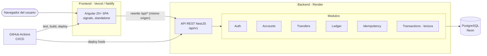

# Estructura del monorepo

Monorepo con **pnpm workspaces**: dos aplicaciones (`apps/api`, `apps/web`), paquetes compartidos (`packages/*`), infraestructura Docker y workflows de GitHub Actions. Cada app puede construirse y desplegarse por separado, pero comparten tooling, lint y el contrato OpenAPI.

## 0. Vista general de la arquitectura



## 1. Árbol de carpetas

```text
digital-wallet-ledger/
├── .github/
│   ├── workflows/
│   │   ├── ci.yml                  # lint, typecheck, unit, e2e (Postgres), build — en cada PR/push
│   │   ├── deploy-api.yml          # tras CI verde en main: dispara deploy hook de Render (o imagen a GHCR)
│   │   ├── deploy-web.yml          # build Angular y deploy (Vercel/Netlify CLI o GitHub Pages)
│   │   └── codeql.yml              # (opcional) análisis estático de seguridad
│   ├── ISSUE_TEMPLATE/             # bug_report.md, feature_request.md
│   ├── pull_request_template.md
│   └── dependabot.yml
├── apps/
│   ├── api/                        # NestJS 11 + TypeORM + PostgreSQL
│   │   ├── src/
│   │   │   ├── main.ts             # bootstrap: helmet, CORS, ValidationPipe, Swagger, prefijo /api/v1
│   │   │   ├── app.module.ts
│   │   │   ├── config/             # env.schema.ts (zod), configuration.ts, typed ConfigService
│   │   │   ├── database/
│   │   │   │   ├── data-source.ts  # DataSource para CLI de migraciones
│   │   │   │   ├── migrations/     # 1730000000000-init.ts, -ledger-triggers.ts, ...
│   │   │   │   └── seeds/          # system-accounts.seed.ts, demo-data.seed.ts
│   │   │   ├── common/
│   │   │   │   ├── decorators/     # @CurrentUser(), @Public(), @Roles(), @IdempotencyKey()
│   │   │   │   ├── filters/        # problem-details.filter.ts (RFC 9457)
│   │   │   │   ├── guards/         # jwt-auth.guard.ts (global), roles.guard.ts
│   │   │   │   ├── interceptors/   # request-id.interceptor.ts, logging
│   │   │   │   ├── errors/         # DomainError + códigos (INSUFFICIENT_FUNDS, ...)
│   │   │   │   ├── money/          # money.ts (bigint helpers), currency.ts
│   │   │   │   └── pagination/     # cursor.ts (encode/decode keyset), page.dto.ts
│   │   │   └── modules/
│   │   │       ├── health/
│   │   │       ├── auth/
│   │   │       │   ├── auth.controller.ts
│   │   │       │   ├── auth.service.ts
│   │   │       │   ├── token.service.ts          # emisión JWT + refresh opaco (hash, rotación, familias)
│   │   │       │   ├── strategies/jwt.strategy.ts
│   │   │       │   ├── entities/refresh-token.entity.ts
│   │   │       │   ├── dto/                      # register.dto.ts, login.dto.ts, auth-response.dto.ts
│   │   │       │   └── auth.service.spec.ts
│   │   │       ├── users/
│   │   │       ├── accounts/
│   │   │       │   ├── accounts.controller.ts
│   │   │       │   ├── accounts.service.ts
│   │   │       │   ├── entities/account.entity.ts
│   │   │       │   └── dto/
│   │   │       ├── ledger/
│   │   │       │   ├── ledger.service.ts         # post(journal) — único escritor del ledger
│   │   │       │   ├── entities/journal-entry.entity.ts
│   │   │       │   ├── entities/ledger-entry.entity.ts
│   │   │       │   ├── reconciliation.service.ts # v1
│   │   │       │   └── ledger.service.spec.ts
│   │   │       ├── idempotency/
│   │   │       │   ├── idempotency.service.ts    # reserve() / complete()
│   │   │       │   ├── entities/idempotency-key.entity.ts
│   │   │       │   └── idempotency-cleanup.job.ts
│   │   │       ├── transfers/
│   │   │       │   ├── transfers.controller.ts
│   │   │       │   ├── transfers.service.ts      # transacción ACID + FOR UPDATE ordenado
│   │   │       │   ├── transfer-rules.ts         # validaciones de negocio puras (fáciles de testear)
│   │   │       │   ├── entities/transfer.entity.ts
│   │   │       │   └── dto/
│   │   │       ├── deposits/                     # top-up simulado (solo demo)
│   │   │       ├── transactions/                 # lado de lectura: historial con filtros + cursor
│   │   │       ├── admin/                        # reconciliación, reversos (v1/extra)
│   │   │       ├── audit/                        # extra
│   │   │       ├── mfa/                          # extra: TOTP
│   │   │       ├── outbox/                       # extra: outbox + worker (SKIP LOCKED)
│   │   │       ├── webhooks/                     # extra: endpoints, firma HMAC, entregas
│   │   │       └── notifications/                # extra: SSE + email (Mailpit en local)
│   │   ├── test/
│   │   │   ├── e2e/                # auth.e2e-spec.ts, transfers.e2e-spec.ts, concurrency.e2e-spec.ts
│   │   │   ├── utils/              # testcontainers setup, factories, helpers de login
│   │   │   └── jest-e2e.config.ts
│   │   ├── Dockerfile              # multi-stage: deps → build → runtime (node:22-alpine, usuario no root)
│   │   ├── nest-cli.json
│   │   ├── tsconfig.json / tsconfig.build.json
│   │   └── package.json
│   └── web/                        # Angular 20+ (standalone, signals, zoneless)
│       ├── src/
│       │   ├── main.ts
│       │   ├── index.html
│       │   ├── styles.scss         # tema Material M3, tokens
│       │   ├── environments/
│       │   └── app/
│       │       ├── app.config.ts   # provideRouter, provideHttpClient(withInterceptors), zoneless
│       │       ├── app.routes.ts   # rutas lazy (loadComponent / loadChildren)
│       │       ├── app.component.ts
│       │       ├── core/
│       │       │   ├── auth/       # auth.store.ts (signals), auth.service.ts, auth.guard.ts, guest.guard.ts
│       │       │   ├── http/       # auth.interceptor.ts (bearer + refresh con cola), error.interceptor.ts,
│       │       │   │               # request-id.interceptor.ts
│       │       │   ├── api/        # cliente tipado generado desde OpenAPI (v1)
│       │       │   ├── layout/     # shell, toolbar, sidenav
│       │       │   └── config/     # tokens de inyección (API_URL, etc.)
│       │       ├── shared/
│       │       │   ├── ui/         # money-display, empty-state, skeleton, confirm-dialog
│       │       │   ├── pipes/      # money.pipe.ts (unidades mínimas → COP), mask-account.pipe.ts
│       │       │   ├── utils/      # idempotency-key.ts (crypto.randomUUID), date utils
│       │       │   └── models/
│       │       └── features/
│       │           ├── auth/           # pages/login, pages/register
│       │           ├── dashboard/      # pages/dashboard, components/balance-card, recent-transactions
│       │           ├── transfers/      # pages/transfer-wizard, pages/transfer-receipt,
│       │           │                   # components/recipient-step, amount-step, confirm-step,
│       │           │                   # data-access/transfers.store.ts
│       │           ├── transactions/   # pages/history, components/filters-bar, transaction-item,
│       │           │                   # data-access/transactions.store.ts (cursor + filtros)
│       │           ├── deposits/       # pages/deposit (demo)
│       │           ├── settings/       # pages/security (sesiones, 2FA), pages/developers (webhooks)
│       │           ├── notifications/  # components/notification-bell, data-access/sse.service.ts
│       │           └── admin/          # pages/reconciliation, pages/audit-logs
│       ├── e2e/                    # Playwright: login.spec.ts, transfer.spec.ts
│       ├── public/                 # favicon, 404.html (si se usa GitHub Pages)
│       ├── Dockerfile              # build Angular → nginx:alpine (para docker compose)
│       ├── nginx.conf              # SPA fallback + proxy /api → api:3000
│       ├── angular.json
│       └── package.json
├── packages/
│   ├── api-contracts/              # openapi.json exportado + tipos generados (openapi-typescript)
│   └── tsconfig/                   # tsconfig.base.json compartido
├── docker/
│   ├── postgres/
│   │   └── init/01-extensions.sql  # CREATE EXTENSION pgcrypto, citext; rol de app con mínimos privilegios
│   └── mailpit/                    # (extra) config de email local
├── docs/
│   ├── adr/                        # 0001-money-as-bigint.md, 0002-double-entry-ledger.md,
│   │                               # 0003-idempotency-strategy.md, 0004-refresh-token-rotation.md
│   ├── architecture.md             # diagramas mermaid
│   ├── explain-analyze.md          # evidencia de índices del historial
│   └── screenshots/
├── docker-compose.yml              # postgres + api + web (+ mailpit con profile "extras")
├── docker-compose.test.yml         # Postgres efímero para e2e locales (alternativa a Testcontainers)
├── .env.example
├── .editorconfig / .prettierrc / eslint.config.mjs
├── .husky/                         # pre-commit (lint-staged), commit-msg (commitlint)
├── commitlint.config.cjs
├── pnpm-workspace.yaml
├── package.json                    # scripts raíz: dev, build, lint, test, test:e2e, seed
├── LICENSE                         # MIT
└── README.md
```

## 2. Backend NestJS: responsabilidades por módulo

| Módulo | Responsabilidad | Depende de | Notas para la entrevista |
|---|---|---|---|
| `ConfigModule` (`config/`) | Carga y **valida** variables de entorno con zod; expone un `ConfigService` tipado | — | "Falla rápido": la app no arranca mal configurada. |
| `DatabaseModule` (`database/`) | `TypeOrmModule.forRootAsync`, migraciones, seeds | Config | `synchronize: false` siempre; migraciones versionadas. |
| `HealthModule` | `GET /health` con `@nestjs/terminus` (ping a BD) | Database | Usado por Docker *healthcheck* y por Render. |
| `AuthModule` | Registro, login, refresh rotativo, logout, sesiones; `JwtStrategy`; guard global con `@Public()` para rutas abiertas | Users, Accounts | El registro crea usuario + billetera en una transacción. |
| `UsersModule` | Entidad `User`, perfil, bloqueo por intentos | — | Nunca expone `password_hash` (DTO de respuesta explícito). |
| `AccountsModule` | Cuentas, lookup por alias/número (datos enmascarados), saldo | — | Autorización por dueño en cada consulta (anti-BOLA). |
| `LedgerModule` | `LedgerService.post()` — **único** que escribe asientos y actualiza saldos; reconciliación | — | Encapsula la invariante Σ débitos = Σ créditos. |
| `IdempotencyModule` | `reserve()` / `complete()` sobre `idempotency_keys`; *job* de limpieza | — | Recibe el `EntityManager` de la transacción del llamador. |
| `TransfersModule` | Caso de uso de transferencia: transacción ACID, `FOR UPDATE` ordenado, reglas de negocio | Accounts, Ledger, Idempotency | `transfer-rules.ts` son funciones puras → tests unitarios sin BD. |
| `DepositsModule` | Recarga simulada desde `SYSTEM_FUNDING` (solo demo) | Ledger, Idempotency | Desactivable con `DEMO_DEPOSITS_ENABLED=false`. |
| `TransactionsModule` | **Lado de lectura**: historial con filtros, cursor y DTOs optimizados | — | Separación lectura/escritura (CQRS ligero) sin sobreingeniería. |
| `AdminModule` | Reconciliación, reversos | Ledger | `RolesGuard` + `@Roles('ADMIN')`. |
| `AuditModule` *(extra)* | Registro *append-only* de acciones sensibles (vía eventos internos) | — | `EventEmitter2` para no acoplar servicios al audit. |
| `MfaModule` *(extra)* | TOTP, códigos de recuperación, *step-up* | Auth | Secreto cifrado AES-256-GCM. |
| `OutboxModule` *(extra)* | Inserta eventos en la transacción; *worker* con `FOR UPDATE SKIP LOCKED` | — | Base para webhooks y notificaciones. |
| `WebhooksModule` *(extra)* | Endpoints, firma HMAC, reintentos con *backoff* | Outbox | Protección SSRF y *timeouts*. |
| `NotificationsModule` *(extra)* | SSE para el front + email (Mailpit local) | Outbox | |
| `common/` | Filtro RFC 9457, decoradores, guards, interceptores (request id), helpers de dinero y paginación | — | Código transversal sin lógica de negocio. |

**Capas dentro de cada módulo:** `controller` (HTTP, DTOs, Swagger) → `service` (caso de uso, transacción) → `rules`/dominio (funciones puras) → `entities` (TypeORM). Los controladores nunca acceden a repositorios directamente.

## 3. Frontend Angular: organización por *features*

| Carpeta | Contenido | Reglas |
|---|---|---|
| `core/` | Singletons de la app: `AuthStore` (signals), interceptores funcionales, guards, layout (shell), cliente API, tokens de configuración | Se importa solo desde `app.config.ts` y features; no depende de `features/`. |
| `shared/` | Componentes de UI "tontos" (presentacionales), pipes (`MoneyPipe`), utilidades (`newIdempotencyKey()`), modelos | Sin estado global ni llamadas HTTP. |
| `features/<feature>/pages/` | Componentes enrutables (*smart*): orquestan store y componentes | Cargados *lazy* con `loadComponent`. |
| `features/<feature>/components/` | Componentes de la feature con `input()` / `output()` | `OnPush`, sin lógica de datos. |
| `features/<feature>/data-access/` | Store de la feature (`signal`, `computed`, métodos que llaman al API) y servicios HTTP | Estado inmutable; `toSignal`/`rxResource`/`httpResource` donde aporte. |
| `features/<feature>/<feature>.routes.ts` | Rutas hijas de la feature | Guards funcionales (`authGuard`, `adminGuard`). |

**Ejemplo de store con signals (transacciones):**

```ts
@Injectable({ providedIn: 'root' })
export class TransactionsStore {
  private api = inject(TransactionsApi);
  readonly items = signal<TransactionItem[]>([]);
  readonly filters = signal<TxFilters>({ type: null, from: null, to: null });
  readonly nextCursor = signal<string | null>(null);
  readonly loading = signal(false);
  readonly hasMore = computed(() => this.nextCursor() !== null);

  async load(reset = false) {
    this.loading.set(true);
    const page = await firstValueFrom(
      this.api.list({ ...this.filters(), cursor: reset ? undefined : this.nextCursor() ?? undefined }));
    this.items.update(cur => (reset ? page.data : [...cur, ...page.data]));
    this.nextCursor.set(page.pageInfo.nextCursor);
    this.loading.set(false);
  }
}
```

**Interceptor de refresh (idea clave):** si una petición recibe `401`, el interceptor lanza **un único** `POST /auth/refresh` compartido (por ejemplo, un `Observable` con `shareReplay(1)` guardado mientras está en vuelo); las demás peticiones esperan ese resultado y se reintentan con el nuevo token. Si el refresh falla, se limpia el `AuthStore` y se navega a `/login`.

## 4. Docker

| Archivo | Propósito |
|---|---|
| `docker-compose.yml` | `postgres` (16/17-alpine, volumen, *healthcheck* `pg_isready`), `api` (depende de postgres *healthy*, corre migraciones al iniciar), `web` (nginx sirviendo el build y haciendo proxy `/api` → `api:3000`, mismo origen que en producción con *rewrites*). Perfil `extras` con `mailpit`. |
| `apps/api/Dockerfile` | Multi-stage con `pnpm deploy --filter api`, imagen final `node:22-alpine`, usuario no root, `HEALTHCHECK`. |
| `apps/web/Dockerfile` | Build Angular → `nginx:alpine` con `nginx.conf` (fallback SPA + cabeceras de seguridad). |
| `docker/postgres/init/` | Extensiones (`pgcrypto`, `citext`) y rol de aplicación con privilegios mínimos. |

## 5. GitHub Actions

**`ci.yml`** (en `pull_request` y `push` a `main`):

1. `setup` — checkout, `pnpm/action-setup`, `actions/setup-node` con caché de pnpm.
2. `lint` + `typecheck` (ambas apps en paralelo con `pnpm -r`).
3. `test-api` — unitarias con cobertura (artefacto `coverage/`).
4. `e2e-api` — *service container* `postgres:16` (o Testcontainers), `migration:run`, `test:e2e` (incluye concurrencia e idempotencia).
5. `test-web` — unitarias de Angular.
6. `build` — `nest build`, `ng build --configuration production`, `docker build` de la API (sin push en PR).
7. `e2e-web` (v1) — Playwright contra `docker compose up`; sube *traces* si falla.

**`deploy-api.yml` / `deploy-web.yml`** (solo `main`, `needs: ci` o `workflow_run`): disparan el *deploy hook* de Render (secreto `RENDER_DEPLOY_HOOK_URL`) y el deploy del front (Vercel/Netlify CLI con token en *secrets*, o `actions/deploy-pages` para GitHub Pages). Usar *environments* de GitHub con protección para `production`.

**`dependabot.yml`**: actualizaciones semanales de npm y de GitHub Actions.

## 6. Scripts raíz (`package.json`)

| Script | Acción |
|---|---|
| `pnpm dev` | API (`nest start --watch`) + web (`ng serve` con `proxy.conf.json` para `/api`) en paralelo |
| `pnpm build` | Build de todos los paquetes |
| `pnpm lint` / `pnpm typecheck` | Calidad en todo el monorepo |
| `pnpm test` / `pnpm test:e2e` | Pruebas unitarias / e2e |
| `pnpm --filter api migration:generate -- <nombre>` / `migration:run` | Migraciones TypeORM |
| `pnpm seed` | Cuentas de sistema + datos demo |
| `pnpm openapi:export` / `pnpm openapi:types` | Exporta `openapi.json` y regenera tipos del front |
